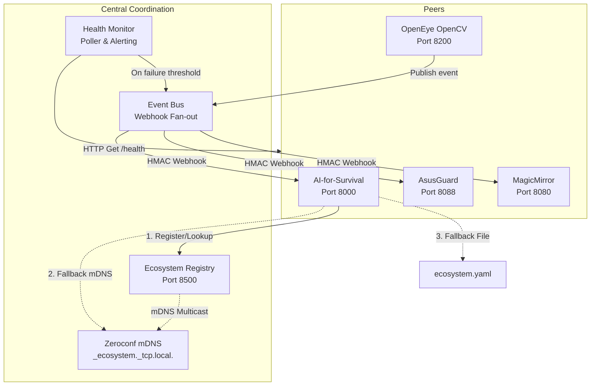

# appEcosystem (Registry & Coordination Layer)

[](https://fastapi.tiangolo.com)
[](https://www.python.org/)
[](https://developer.apple.com/macos/)
[](https://www.kernel.org/)
[](#security-architecture)

The **appEcosystem** is a lightweight, ultra-secure, and resilient coordination layer designed for **Smart Industries LLC**. It integrates four independent sub-systems into a unified, intelligent home-surveillance, security triage, and AI-assisted automation cluster. 

The architecture is **standalone-first**: if the coordination layer goes offline, every connected application degrades gracefully and continues to operate as an independent, fully functioning system.

---

## 1. Connected Projects

| Project / Service | Host / Port | Tech Stack | Role in Ecosystem |
| :--- | :--- | :--- | :--- |
| **AI-for-Survival** | `192.168.50.73:8000` | Python, FastAPI, Llama3/RAG | Offline LLM assistant and command execution manager. Orchestrates active defense and system triage. |
| **OpenEye** | `192.168.50.73:8200` | Python, OpenCV, React | Video surveillance, physical intrusion detection, computer vision alerts, and smart home automation. |
| **MagicMirror** | `192.168.50.73:8080` | Node.js, Electron, Express | Verbal communication hub, ambient smart-HUD, and real-time event visualization interface. |
| **AsusGuard** | `192.168.50.73:8088` | Python, Flask, Daemon | Network traffic analysis, router syslog parsing, device control, and network threat blocking. |
| **appEcosystem (Registry)** | `127.0.0.1:8500` | Python, FastAPI, Zeroconf | Central service registry, async webhook event bus, and discovery broker. |

---

## 2. Core Architecture



### 2.1 The 3-Mode Discovery Cascade
Connected apps find one another dynamically through an automated fallback priority cascade:
1. **Service Registry (Port 8500)**: First choice. Query the central coordinator for high-availability endpoints, sorted by priority.
2. **mDNS (Zeroconf)**: Second choice. If the central registry is unconfigured or unreachable, query local multicast DNS for services broadcasting under `_ecosystem._tcp.local.`.
3. **Static Peer Config**: Third choice. Fall back to local declarations inside `ecosystem.yaml`.
4. **Standalone Mode**: Final fallback. If no peers are found, all integration endpoints degrade gracefully without crashing.

### 2.2 Async Event Bus (Webhook Fan-out)
Applications communicate decoupled, real-time events via high-performance webhook fan-outs.
* Supports **wildcard subscriptions** (e.g. `security.*` matches `security.intrusion` and `security.threat_blocked`).
* Features a standard **Event Envelope** containing correlation IDs for distributed tracing.
* Enforces mandatory **HMAC-SHA256 signatures** on all published webhook payloads.

---

## 3. Quick Start & Setup

### 3.1 Prerequisite Requirements
* **macOS** (10.15+) or **Linux** (Raspberry Pi OS Bookworm or Ubuntu 20.04+).
* **Python 3.10** or **3.12** (recommended).
* **Node.js 18+** & **npm** (for Javascript clients and sub-projects).

### 3.2 Installation
Clone the repository and run the setup script:
```bash
# 1. Clone repository
git clone https://github.com/SmartIndustriesLLC/appEcosystem.git
cd appEcosystem

# 2. Run the platform installer (creates .venv, installs dependencies)
./scripts/install.sh
```

### 3.3 Configuration
Copy `.env.example` to `.env` and set the environment variables (see that file
for the full list). Project paths and ports live in `ecosystem.yaml`; secrets
and machine-specific values come from the environment.

Key variables:

| Variable | Default | Purpose |
|----------|---------|---------|
| `ECOSYSTEM_HMAC_SECRET` | _(dev default)_ | Shared inter-service HMAC secret. **Required in production** — services refuse to start with the default unless `ECOSYSTEM_ENV=dev`. |
| `ECOSYSTEM_ENV` | `dev` | `dev` / `staging` / `production`. Non-`dev` enables fail-closed checks. |
| `ECOSYSTEM_REGISTRY_HOST` | `127.0.0.1` | Registry bind host. Use `0.0.0.0` only behind a trusted-network firewall. |
| `ECOSYSTEM_CORS_ORIGINS` | `*` | Comma-separated allowed origins (dev default `*`). |
| `ECOSYSTEM_BASE_PATH` | repo parent dir | Root containing the sibling project repos. |
| `ECOSYSTEM_HARNESS_URL` / `ASUSGUARD_PORT` | `http://localhost:8088` | Cyber-claude-harness daemon location. |

```bash
# Generate a strong shared secret:
python -c "import secrets; print(secrets.token_hex(32))"
export ECOSYSTEM_HMAC_SECRET="<generated-value>"
```

### 3.4 Service Commands
```bash
# Activate virtual environment
source .venv/bin/activate

# Start the registry only / registry + all connected apps
python -m cli start
python -m cli start-all

# Restart the registry, or watch a live health dashboard
python -m cli restart
python -m cli monitor            # add --once for a single snapshot, -i N for interval

# Status, logs
python -m cli status
python -m cli logs openeye

# Stop the registry / everything (SIGTERM, escalating to SIGKILL after 5s)
python -m cli stop
python -m cli stop-all
```

---

## 4. Security Architecture

To protect Smart Industries' infrastructure from compromise, a **Zero-Trust Inter-Service Auth** model is applied:

1. **Replay-resistant HMAC-SHA256 signatures**: Authenticated requests carry `X-Ecosystem-Signature`, `X-Ecosystem-Timestamp`, and `X-Ecosystem-Nonce` headers. The signature binds the method, a host-independent canonical path, the timestamp, the nonce, and a digest of the body. Receivers reject signatures outside a ±300s window and replayed nonces.
2. **Short-Lived Bearer Tokens**: Microservice-to-microservice REST queries may use a Bearer token in the `Authorization` header. Tokens bind a random value and a 24-hour expiration into the signature and undergo a 12-hour proactive rotation cycle.
3. **Fail-closed secret handling**: Services refuse to start with the built-in development secret when `ECOSYSTEM_ENV` is not `dev`; the registry binds to loopback by default.
4. **Cyber Claude Harness Guard**: Security-critical commands (such as IP blocking, log analysis, router reconfigurations) are routed through a localized security harness running isolated sandboxed agents.

---

## 4a. Deployment & Observability

**Docker**
```bash
docker build -t appecosystem-registry .
# Bind to a trusted network; provide the shared secret at runtime.
docker run -d --name ecosystem-registry \
  -p 127.0.0.1:8500:8500 \
  -e ECOSYSTEM_HMAC_SECRET="$ECOSYSTEM_HMAC_SECRET" \
  appecosystem-registry
```
The image runs as a non-root user, emits JSON logs (`ECOSYSTEM_LOG_FORMAT=json`),
and ships a container `HEALTHCHECK` against `/health`.

**Metrics** — the registry exposes Prometheus text metrics at `GET /metrics`:
`ecosystem_registry_up`, `ecosystem_services{status=...}`,
`ecosystem_health_checks_total`, `ecosystem_health_check_failures_total`,
`ecosystem_events_{published,delivered,failed}_total`,
`ecosystem_auto_deregistrations_total`.

**Logging** — set `ECOSYSTEM_LOG_LEVEL` (default `INFO`) and
`ECOSYSTEM_LOG_FORMAT=json` for structured logs suitable for Loki/ELK/CloudWatch.

---

## 5. Development & Contribution
* Detailed developer usage and code snippets for API integration can be found in [usage.md](file:///Volumes/Locker2/GitHub/appEcosystem/usage.md).
* A complete task-tracker and pending audit goals is located in [todos_changelog.md](file:///Volumes/Locker2/GitHub/appEcosystem/todos_changelog.md).
