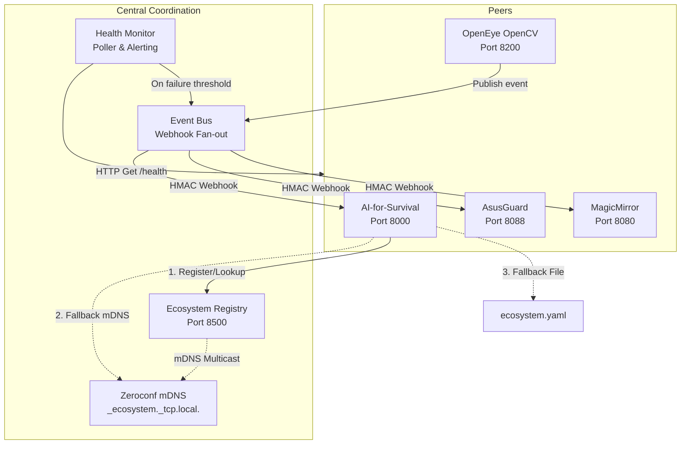

# appEcosystem (Registry & Coordination Layer)

[](https://fastapi.tiangolo.com)
[](https://www.python.org/)
[](https://developer.apple.com/macos/)
[](https://www.kernel.org/)
[](#security-architecture)

The **appEcosystem** is a lightweight, ultra-secure, and resilient coordination layer designed for **Smart Industries LLC**. It integrates four independent sub-systems into a unified, intelligent home-surveillance, security triage, and AI-assisted automation cluster. 

The architecture is **standalone-first**: if the coordination layer goes offline, every connected application degrades gracefully and continues to operate as an independent, fully functioning system.

---

## 1. Connected Projects

| Project / Service | Host / Port | Tech Stack | Role in Ecosystem |
| :--- | :--- | :--- | :--- |
| **AI-for-Survival** | `192.168.50.73:8000` | Python, FastAPI, Llama3/RAG | Offline LLM assistant and command execution manager. Orchestrates active defense and system triage. |
| **OpenEye** | `192.168.50.73:8200` | Python, OpenCV, React | Video surveillance, physical intrusion detection, computer vision alerts, and smart home automation. |
| **MagicMirror** | `192.168.50.73:8080` | Node.js, Electron, Express | Verbal communication hub, ambient smart-HUD, and real-time event visualization interface. |
| **AsusGuard** | `192.168.50.73:8088` | Python, Flask, Daemon | Network traffic analysis, router syslog parsing, device control, and network threat blocking. |
| **appEcosystem (Registry)** | `0.0.0.0:8500` | Python, FastAPI, Zeroconf | Central service registry, async webhook event bus, and discovery broker. |

---

## 2. Core Architecture



### 2.1 The 3-Mode Discovery Cascade
Connected apps find one another dynamically through an automated fallback priority cascade:
1. **Service Registry (Port 8500)**: First choice. Query the central coordinator for high-availability endpoints, sorted by priority.
2. **mDNS (Zeroconf)**: Second choice. If the central registry is unconfigured or unreachable, query local multicast DNS for services broadcasting under `_ecosystem._tcp.local.`.
3. **Static Peer Config**: Third choice. Fall back to local declarations inside `ecosystem.yaml`.
4. **Standalone Mode**: Final fallback. If no peers are found, all integration endpoints degrade gracefully without crashing.

### 2.2 Async Event Bus (Webhook Fan-out)
Applications communicate decoupled, real-time events via high-performance webhook fan-outs.
* Supports **wildcard subscriptions** (e.g. `security.*` matches `security.intrusion` and `security.threat_blocked`).
* Features a standard **Event Envelope** containing correlation IDs for distributed tracing.
* Enforces mandatory **HMAC-SHA256 signatures** on all published webhook payloads.

---

## 3. Quick Start & Setup

### 3.1 Prerequisite Requirements
* **macOS** (10.15+) or **Linux** (Raspberry Pi OS Bookworm or Ubuntu 20.04+).
* **Python 3.10** or **3.12** (recommended).
* **Node.js 18+** & **npm** (for Javascript clients and sub-projects).

### 3.2 Installation
Clone the repository and run the setup script:
```bash
# 1. Clone repository
git clone https://github.com/SmartIndustriesLLC/appEcosystem.git
cd appEcosystem

# 2. Run the platform installer (creates .venv, installs dependencies)
./scripts/install.sh
```

### 3.3 Configuration
Configure the shared credentials and paths in `ecosystem.yaml`:
```yaml
ecosystem:
  name: "appEcosystem"
  base_path: "/Volumes/Locker2/GitHub"

# IMPORTANT: Export ECOSYSTEM_HMAC_SECRET to your shell or system environment variables
auth:
  hmac_secret: "${ECOSYSTEM_HMAC_SECRET:-dev-ecosystem-secret-change-in-production}"
```

### 3.4 Service Commands
```bash
# Activate virtual environment
source .venv/bin/activate

# 1. Start the service registry and all connected apps in the background
python -m cli start-all

# 2. Monitor status and service health
python -m cli status

# 3. Stream real-time logs for a specific application
python -m cli logs openeye

# 4. Stop all processes safely
python -m cli stop-all
```

---

## 4. Security Architecture

To protect Smart Industries' infrastructure from compromise, a **Zero-Trust Inter-Service Auth** model is applied:

1. **HMAC-SHA256 Webhook Verification**: Every event published through the event bus contains an `X-Ecosystem-Signature` header. The receiver computes the HMAC over the compact JSON request body using the shared secret and rejects unsigned or mismatching payloads.
2. **Short-Lived Bearer Tokens**: Microservice-to-microservice REST queries use a Bearer token in the `Authorization` header. Tokens contain a 24-hour expiration timestamp and undergo a 12-hour proactive rotation cycle.
3. **Cyber Claude Harness Guard**: Security-critical commands (such as IP blocking, log analysis, router reconfigurations) are routed through a localized security harness (`localhost:8088`) running isolated sandboxed agents.

---

## 5. Development & Contribution
* Detailed developer usage and code snippets for API integration can be found in [usage.md](file:///Volumes/Locker2/GitHub/appEcosystem/usage.md).
* A complete task-tracker and pending audit goals is located in [todos_changelog.md](file:///Volumes/Locker2/GitHub/appEcosystem/todos_changelog.md).
